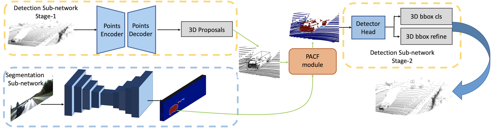

# PI-RCNN

Code release for [PI-RCNN: An Efficient Multi-sensor 3D Object Detector with Point-based Attentive Cont-conv Fusion Module](https://arxiv.org/abs/1911.06084) (AAAI 2020) based on the codebase of [OpenPCDet](https://github.com/open-mmlab/OpenPCDet).



To run this code, please first follow the original [README.md](./README.md) to install the environment and dependencies. And install the knn_cuda:

```
pip install --upgrade https://github.com/unlimblue/KNN_CUDA/releases/download/0.2/KNN_CUDA-0.2-py3-none-any.whl --user
```

knn_cuda needs the ninja to be installed. So if you encounter error of no ninja, please try to run the following code to install ninja:

```
wget https://github.com/ninja-build/ninja/releases/download/v1.8.2/ninja-linux.zip
sudo unzip ninja-linux.zip -d /usr/local/bin/
sudo update-alternatives --install /usr/bin/ninja ninja /usr/local/bin/ninja 1 --force
```

### KITTI Dataset

Download and Organize the [KITTI 3D Object Detection Dataset](http://www.cvlibs.net/datasets/kitti/eval_object.php?obj_benchmark=3d) and [KITTI Semantic Segmentation Dataset](http://www.cvlibs.net/datasets/kitti/eval_semantics.php) files as follows:

```
PI_RCNN
├── data
│   ├── kitti
│   │   ├── ImageSets
│   │   │   training
│   │   │   ├──calib & velodyne & label_2 & image_2 & (optional: planes)
│   │   │   testing
│   │   │   ├──calib & velodyne & image_2
|   |   |   semantic
│   │   │   ├── ImageSets
│   │   │   ├── training
│   │   │   ├── testing
```

Note, besides common data augmentation via modifying the calibration matrix mentioned in the paper, we also realize the GT-AUG in this code. 
To use GT-AUG, you should first pretrain a image segmentation sub-network and then generate dbinfos with image segmentation features. We explain the details in the following parts.

### Training

#### Pretrain the image segmentation sub-network

The default config file is [pi_rcnn_seg_pretrain.yaml](./tools/cfgs/kitti_models/pi_rcnn_seg_pretrain.yaml)

Run this command to pretrain the image segmentation sub-network:

```
python train.py --cfg_file cfgs/kitti_models/pi_rcnn_seg_pretrain.yaml
```

The run this command to generate the image segmentation prediction for kitti object dataset: 
(You can skip this step, and train PI-RCNN via loading the weights of pretrained image seg subnet. But it is not recommended, because it will occupy extra memory.)

```
python test.py --save_to_file \
                --cfg_file cfgs/kitti_models/pi_rcnn_seg_pretrain.yaml \
                --ckpt ../output/kitti_models/pi_rcnn_seg_pretrain/default/ckpt/checkpoint_epoch_XX.pth \
                --set DATA_CONFIG.DATA_PATH '../data/kitti/' DATA_CONFIG.DATA_SPLIT.test trainval DATA_CONFIG.NO_LABEL True
```

The results will be saved in the ```../output/kitti_models/pi_rcnn_seg_pretrain/default/eval/epoch_XX/trainval/default/final_result/data/```

#### Generate dbinfos with image segmentation features

If you don't want to use GT-AUG, you can skip this step.

To generate the generate dbinfos with image segmentation features, you should add the following configs in the ```cfg/datasets/kitti_dataset.yaml```:

```
GT_DATABASE:
    TAG: 'with_seg'
    WITH_SEG: True
    SEG_FEATURES_DIR: './output/kitti_models/pi_rcnn_seg_pretrain/default/eval/epoch_XX/trainval/default/final_result/data'
```

then run this command:

```
python -m pcdet.datasets.kitti.kitti_dataset create_kitti_infos tools/cfgs/dataset_configs/kitti_dataset.yaml
```

the dbinfos will be saved in the ```data/kitti/gt_database_with_seg```, and each files will contain both the original ```xyzi``` 3D points and the corresponding segmentation features retrieved from image.

#### Train PI-RCNN

You can train PI-RCNN via the saved output of pretrained image segmentation sub-net: (This is recommended, because it saves the GPU memory and training time.)

```
python train.py --cfg_file cfgs/kitti_models/pi_rcnn_no_image_backbone.yaml \
                --set DATA_CONFIG.SEG_FEATURES_DIR ../output/kitti_models/pi_rcnn_seg_pretrain/default/eval/epoch_XX/trainval/default/final_result/data
```

Or train PI-RCNN via directly loading (and fixing) the weights of pretrained image seg subnet:

```
python train.py --cfg_file cfgs/kitti_models/pi_rcnn_fix_image_backbone.yaml \
                --set MODEL.BACKBONE_IMAGE.PRETRAINED_CKPT ../output/kitti_models/pi_rcnn_seg_pretrain/default/ckpt/checkpoint_epoch_XX.pth
```

### Testing

If you training with ```pi_rcnn_fix_image_backbone.yaml```, the ckpt will save the weights from both image sub-net and point sub-net. So you just run this command to test:

```
python test.py --cfg_file cfgs/kitti_models/pi_rcnn_fix_image_backbone.yaml \
                --ckpt /path/to/ckpt
```

If you training with ```pi_rcnn_no_image_backbone.yaml```, the ckpt only saves the weights of point sub-net, so you should run this command to test:

```
python test.py --cfg_file cfgs/kitti_models/pi_rcnn_no_image_backbone.yaml \
                --set DATA_CONFIG.SEG_FEATURES_DIR /path/to/presaved_seg_features
```

note the ```/path/to/presaved_seg_features``` should be consistent with training.


### Citation

If you find this work useful in your research, please consider cite:

```
@inproceedings{xie2020pi,
  title={Pi-rcnn: An efficient multi-sensor 3d object detector with point-based attentive cont-conv fusion module},
  author={Xie, Liang and Xiang, Chao and Yu, Zhengxu and Xu, Guodong and Yang, Zheng and Cai, Deng and He, Xiaofei},
  booktitle={Proceedings of the AAAI Conference on Artificial Intelligence},
  volume={34},
  number={07},
  pages={12460--12467},
  year={2020}
}
```

